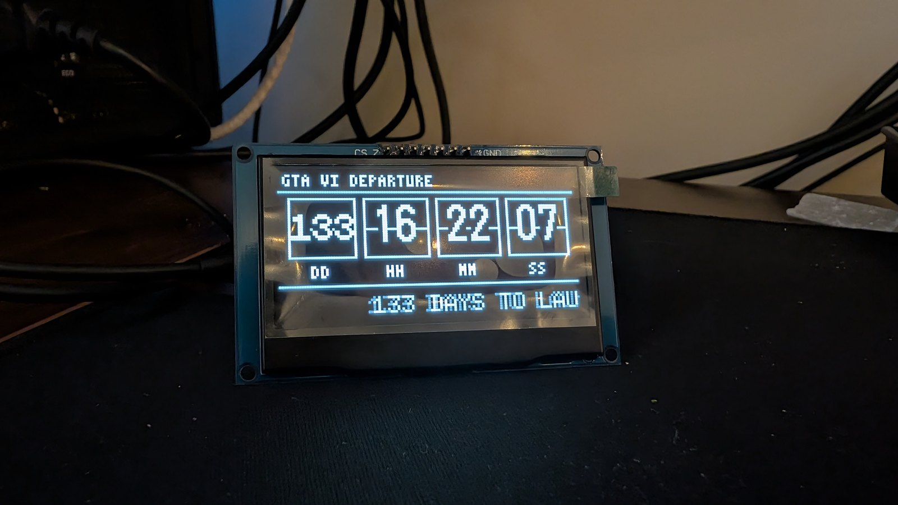
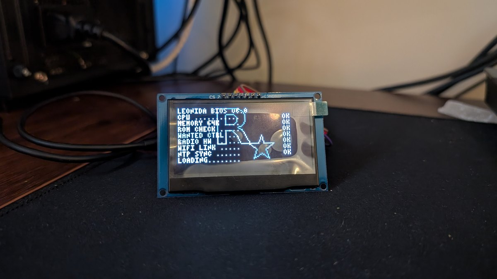
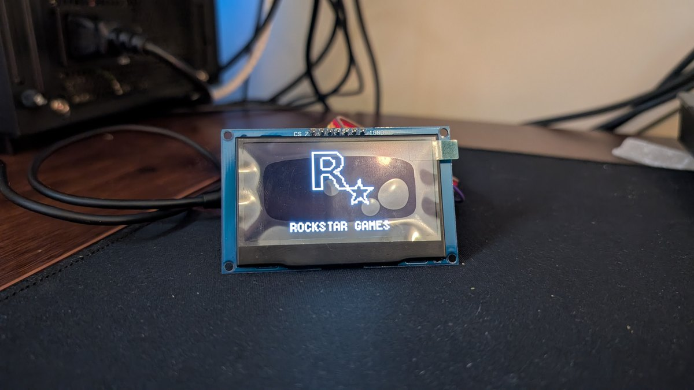
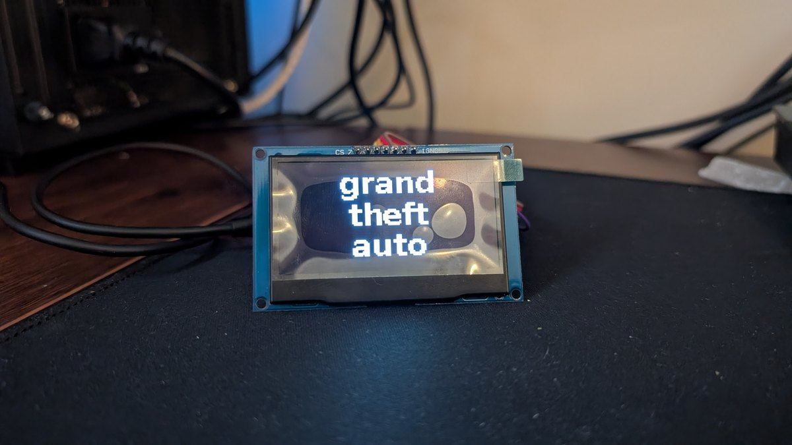
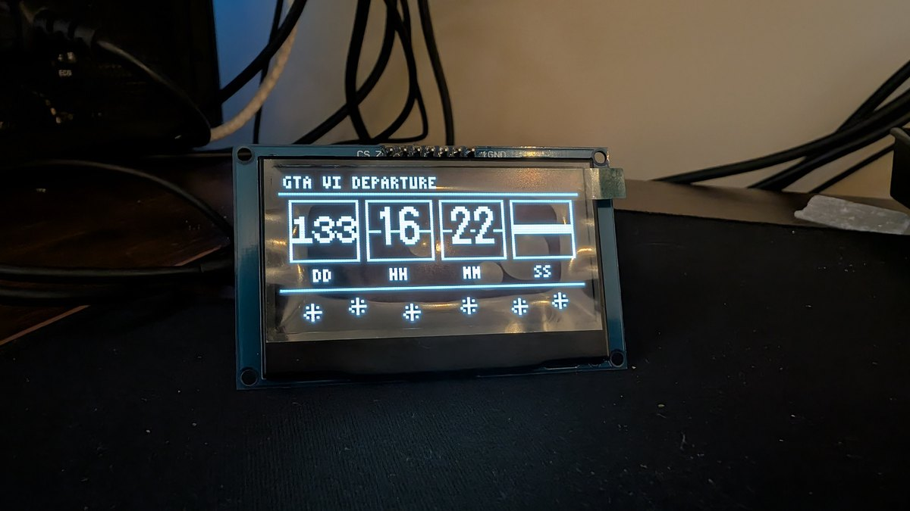

# GTA VI Countdown Clock

A physical countdown-to-*Grand Theft Auto VI* clock for the ESP32, driving a 2.42" SSD1309 OLED — with a full cinematic boot sequence, a split-flap departure board, and rotating info strips. Set-and-forget: it grabs the time over WiFi once, then free-runs on the ESP32's internal clock and quietly re-syncs itself once a day.

Counting down to **November 19, 2026**.

> **Heads up:** This is a hobby project and a fan tribute. It is not affiliated with, endorsed by, or connected to Rockstar Games or Take-Two Interactive. *Grand Theft Auto* and related marks belong to their respective owners. See [Legal](#legal).


<sub>The whole boot sequence, real hardware, real time. [Watch the full 1-minute video →](https://github.com/dspl1236/GTA6-Countdown-Clock/releases/latest)</sub>

---

## Features

**Cinematic boot sequence** — a nostalgic power-on that plays every reset:

1. **BIOS POST self-test** — an old-PC style boot screen that prints line by line (`CPU ... OK`, `MEMORY 64K ... OK`, `WANTED CTRL ... OK`). The `WIFI LINK` and `NTP SYNC` lines show **real connection status** as it links in the background.
2. **Rockstar R★ publisher card** — big, centered, with a neon flicker, panning out to reveal "ROCKSTAR GAMES."
3. **GTA VI title card** — the "grand theft auto" wordmark holds on its own.
4. **Pull-back into the world** — the VI logo recedes into a Miami/Vice City scene (synthwave sun, skyline, palms, scrolling road) as a car drives up the road.
5. **Logo finale** — the scene drops away, the VI swells back to full screen, then flickers out into the clock.

**Split-flap departure board** — the main clock face shows `DD : HH : MM : SS` in boxed cells with a mechanical flap flash on each digit change. Handles 3-digit day counts.

**Rotating bottom strips** (cycle continuously):
- **Facts ticker** — scrolls live computed facts: days / weeks / hours remaining, release date.
- **6-star wanted meter** — GTA VI's six-star system; fills roughly one star every ~24 days so all six light up right at launch.
- **Bullet impacts** — bullets fly in one at a time and *hit*, leaving cracked holes with impact flashes.

**Periodic drive-by** — every few minutes the Miami scene returns and a car swerves through the lanes for a few seconds, then back to the clock.

**Self-managing time** — syncs NTP once at boot, then runs on the internal RTC with WiFi **off** to save power. Re-syncs every 24 hours: if it's on a known network it corrects any drift; if not, it keeps its current time and tries again next cycle. Good for portable/battery use.

---

## Gallery

The clock face — a split-flap departure board counting down to launch:



The boot sequence, frame by frame:

| 1. BIOS POST self-test | 2. Rockstar publisher card |
|:---:|:---:|
|  |  |
| **3. Title card** | **4. Pull-back into Vice City** |
|  |  |

And the six-star wanted meter, one of the rotating bottom strips — it fills a star roughly every 24 days, so all six light up right at launch:



---

## Hardware

| Part | Notes |
|------|-------|
| **ESP32 WROOM-32 dev board** | The classic 30/38-pin ESP32. 2.4 GHz WiFi only. |
| **2.42" OLED, SSD1309 driver, 128×64** | 7-pin **SPI** mode. 3.3 V logic (many modules are 5 V tolerant). |
| Dupont wires | 6 connections (see wiring). |
| USB cable / power | 5 V via the dev board, or a LiPo (see [Power](#power--battery)). |

> This targets the **SSD1309**. The very similar **SSD1306** 0.96"/1.3" displays use a different U8g2 constructor and resolution — you'd need to change the constructor line if you use one.

### Wiring (SPI)

| OLED pin | ESP32 GPIO | Sketch define |
|----------|-----------|---------------|
| CS       | GPIO 5    | `PIN_CS`  |
| DC       | GPIO 15   | `PIN_DC`  |
| RES/RST  | GPIO 4    | `PIN_RST` |
| SDA/MOSI | GPIO 23   | (hardware VSPI) |
| SCK/CLK  | GPIO 18   | (hardware VSPI) |
| VCC      | 3V3       | — |
| GND      | GND       | — |

The sketch uses hardware VSPI, so MOSI/SCK are fixed at GPIO 23/18. CS, DC, and RST are configurable at the top of the sketch.

See [`docs/WIRING.md`](docs/WIRING.md) for a full pinout and troubleshooting.

---

## Quick start

1. **Install the Arduino IDE** (2.x) and add ESP32 board support:
   - File → Preferences → *Additional Boards Manager URLs*:
     `https://raw.githubusercontent.com/espressif/arduino-esp32/gh-pages/package_esp32_index.json`
   - Tools → Board → Boards Manager → install **esp32 by Espressif**.
2. **Install the U8g2 library** — Tools → Manage Libraries → search **U8g2** (by oliver) → Install.
3. **Open** `GTA6_SplitFlap/GTA6_SplitFlap.ino`.
4. **Set your WiFi** at the top of the sketch:
   ```cpp
   #define WIFI_SSID     "YOUR_WIFI_SSID"
   #define WIFI_PASSWORD "YOUR_WIFI_PASSWORD"
   ```
5. **Set your timezone** — the default is US Eastern Standard (`-5 * 3600`). Change `GMT_OFFSET_SEC` for your zone. (See [Configuration](#configuration).)
6. **Select** Tools → Board → **ESP32 Dev Module**, pick your COM port, and **Upload**.
7. Open Serial Monitor at **115200** to watch the boot log (`WiFi OK`, `NTP OK`).

First power-on should be somewhere with WiFi so it can grab the time. After that it free-runs and self-corrects.

---

## Configuration

All at the top of `GTA6_SplitFlap.ino`:

| Define | Default | What it does |
|--------|---------|--------------|
| `WIFI_SSID` / `WIFI_PASSWORD` | placeholders | Your 2.4 GHz network. |
| `GMT_OFFSET_SEC` | `-5 * 3600` (EST) | Timezone offset in seconds. E.g. Pacific = `-8*3600`, UTC = `0`, Central Europe = `1*3600`. |
| `DAYLIGHT_OFFSET` | `3600` | DST offset. Set to `0` if you don't want DST applied. |
| `GTA6_RELEASE_UTC` | `1795064400` | Target epoch — **Nov 19 2026, 00:00 EST**. Change to count down to anything. |
| `CONTRAST` | `230` | OLED brightness 0–255 (dimmed a little to reduce burn-in). |
| `SPI_CLOCK` | `8000000` | SPI bus speed. 8 MHz is smooth; can try 16 MHz. |
| `DRIVEBY_INTERVAL_MS` | 3 min | How often the drive-by scene plays. |
| `NTP_RESYNC_MS` | 24 h | How often it wakes WiFi to re-sync the clock. |

**Counting down to something else?** Change `GTA6_RELEASE_UTC` to your target's Unix timestamp (UTC). Plenty of online epoch converters; just remember it's in UTC and the display applies your `GMT_OFFSET_SEC`.

---

## Power & battery

By default the clock:
- uses WiFi **only** for the initial NTP sync and a brief window every 24 h,
- runs the rest of the time on the ESP32's internal RTC with the **radio off**.

Rough current draw:
- WiFi active (brief sync windows): spiky, 150–250 mA
- Normal running, radio off: **~60 mA** (CPU + OLED)

On a LiPo, expect roughly:

| Battery | Approx. runtime (radio off after sync) |
|---------|----------------------------------------|
| 500 mAh  | ~7 h |
| 1000 mAh | ~14 h |
| 2500 mAh | ~35 h |

The internal RTC drifts a little (seconds to ~a minute per day), which is irrelevant for a countdown measured in days — and it gets corrected on the next 24 h re-sync when it's back on a known network.

> **Note:** If it first boots with **no** WiFi ever reached, it has no time to count from and shows fallback values until it reaches a network once. Do the first power-on at home.

---

## How it works (brief)

- **Display:** [U8g2](https://github.com/olikraus/u8g2) in full-buffer mode over hardware SPI. All graphics — logos, car, scene, stars — are hand-built 1-bit XBM bitmaps drawn with a small nearest-neighbor scaler (plus an outline-preserving variant so thin logos don't break when shrunk).
- **Time:** `configTime()` + NTP, then `time()` against the target epoch to compute days/hours/minutes/seconds every tick.
- **Boot sequence:** a single frame loop with timed phases; WiFi/NTP are polled non-blocking each frame so the animation never stalls waiting on the network.

---

## Repo layout

```
GTA6_SplitFlap/GTA6_SplitFlap.ino   the firmware (single sketch)
docs/WIRING.md                      full pinout + troubleshooting
docs/images/                        photos / screenshots
hardware/                           notes, optional case files
LICENSE                             MIT
CONTRIBUTING.md                     how to help
```

---

## Roadmap / ideas

- ILI9341 **color TFT** version (Miami palette in full color)
- 3D-printed **desk-wedge case**, finished in translucent resin
- Optional real *Newswire*-style headlines via a self-hosted JSON feed
- Configurable target date without recompiling

PRs and forks welcome — see [`CONTRIBUTING.md`](CONTRIBUTING.md).

---

## Credits

Built by [**dspl1236**](https://github.com/dspl1236).

Thanks to [olikraus/u8g2](https://github.com/olikraus/u8g2) for the display library and the ESP32 Arduino core team.

---

## Legal

This is an unofficial, non-commercial **fan project**. It is **not** affiliated with, authorized, endorsed by, or in any way officially connected to **Rockstar Games**, **Take-Two Interactive**, or any of their subsidiaries.

*Grand Theft Auto*, *GTA*, *GTA VI*, the Rockstar Games logo, and all related names, marks, and imagery are trademarks and/or copyrights of their respective owners. References here are used for identification and tribute purposes only.

The **code** in this repository is released under the [MIT License](LICENSE). This license covers the original source code only — it does **not** grant any rights to third-party trademarks or brand assets. The recreated logos/scenes are original pixel art made for this project as an homage; if you fork this, use them at your own discretion and don't imply official endorsement.

Release date shown (Nov 19 2026) reflects publicly announced information at the time of writing and may change.
